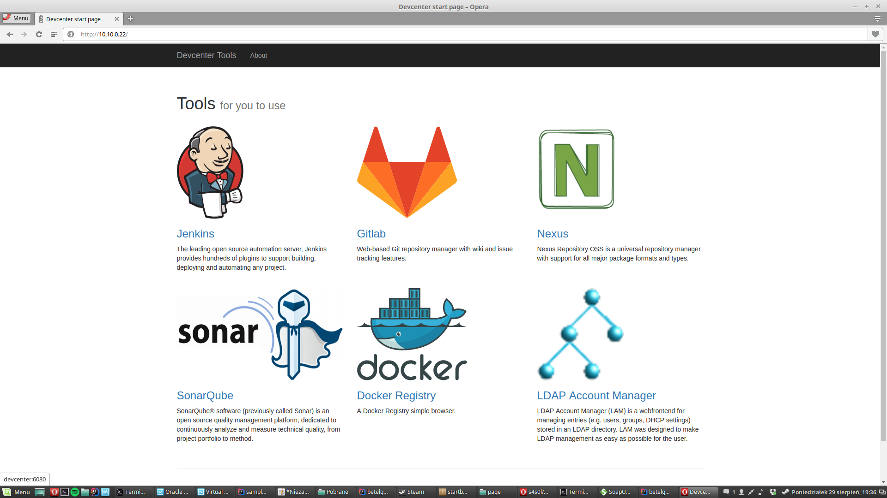

# betelgeuse-devcenter
Vagrant script that brings up small development environment: LDAP, GitLab, Jenkins, Nexus, SonarQube, Docker Registry

# How to use it

HERE WILL BE WISDOM, But for now what you need is:

* Linux 
* Virtualbox
* Vagrant

Then you clone, go into this directory run:
```
./vagrant.sh up
```
And after a longer period of time..... just visit http://10.10.0.22:80.

You should see something like:

